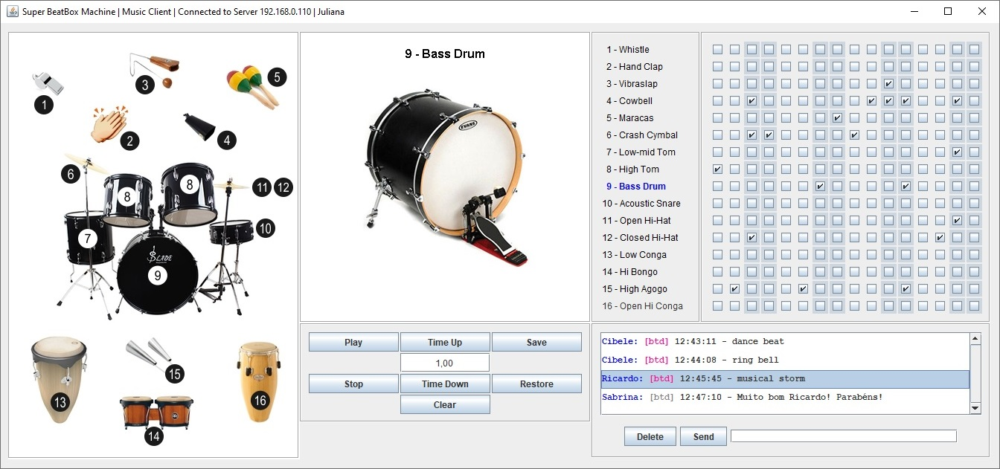

# Super BeatBox Machine

## Escolha seu Idioma   Choose Your Language 

- [Português (Brasil)](#versão-em-português)
- [English (United States)](#english-version)

 

##  Versão em Português

### Super BeatBox Machine - Resumo
A **Super BeatBox Machine** é um **projeto de transformação** criado para consolidar os conhecimentos adquiridos em Java SE. A aplicação permite criar e reproduzir um padrão musical feito com batidas de instrumentos de percussão. É possível escolher sons entre 16 instrumentos.

A Super BeatBox Machine é uma aplicação cliente-servidor que disponibiliza um engenhoso sistema de chat. Através dele é possível enviar um padrão musical via rede aos usuários conectados ao servidor. Além disso, é possível salvar um padrão musical em disco — para recuperá-lo, alterá-lo e enviá-lo via chat em momento posterior.

A Super BeatBox Machine é um desafio de programação que não utiliza IDE — foi construída no Notepad++ e compilada no prompt de comando da console. O projeto utiliza um conjunto de tecnologias complexas de difícil compreensão e domínio, entre elas: **Biblioteca Java Swing, GridLayout, GridBagLayout, JFrame, JPanel, PlainDocument, File, JFileChooser, API Java Sound, Sequencer, MidiEvent, Serialização de Objetos em Disco, Serialização de Objetos em Rede, Socket, ServerSocket, Segmentação Múltipla, Classe Interna e Mapeamento de Teclas**.

A **Super BeatBox Machine** tem como base o projeto **BeatBox** — desenvolvido ao longo do livro **Use a cabeça! Java**, de Kathy Sierra e Bert Bates. O projeto trabalhado no livro (BeatBox) foi sistematicamente modificado e novos recursos adicionados, até transformar-se em **Super BeatBox Machine**.  

Para maiores informações, visite a página oficial do projeto:  
<https://togtec.com.br/projetos/super-beatbox-machine/resumo.php>

### Tecnologias
  * Java SE (17)
  
### IDE  
  * Notepad++

### Captura de tela

Ver galeria completa de imagens em:  
<https://togtec.com.br/projetos/super-beatbox-machine/imagens.php>

### Funcionalidades
1. Usuário cria um padrão de batidas.
2. Usuário ouve o padrão recém-criado.
3. Usuário envia o padrão recém-criado via chat, para todos os usuários conectados.
4. Usuário recebe um padrão via chat.
5. Usuário ouve o padrão recebido.
6. Usuário salva em disco o padrão recebido.

### Executando o código localmente
Visite a página de download e instalação do projeto em:  
<https://togtec.com.br/projetos/super-beatbox-machine/download.php>

 

##  English Version

### Super BeatBox Machine - Overview
The **Super BeatBox Machine** is a **transformation project** created to consolidate the knowledge acquired in Java SE. The application allows users to create and play musical patterns made with percussion instrument beats. You can choose from 16 different instrument sounds.

The Super BeatBox Machine is a client-server application that provides an innovative chat system. It allows users to send musical patterns over the network to others connected to the server. Additionally, users can save a musical pattern to disk, with the option to reload, modify, and resend it via chat at a later time.

The Super BeatBox Machine is a programming challenge built without an IDE — it was developed using Notepad++ and compiled from the command prompt. The project utilizes a complex set of technologies that require advanced understanding and skill, including: **Java Swing Library, GridLayout, GridBagLayout, JFrame, JPanel, PlainDocument, File, JFileChooser, Java Sound API, Sequencer, MidiEvent, Disk Object Serialization, Network Object Serialization, Socket, ServerSocket, Multithreading, Inner Class, and Key Mapping**.

The **Super BeatBox Machine** is based on the **BeatBox** project from the book **Head First Java**, by Kathy Sierra and Bert Bates. The project described in the book (BeatBox) was systematically modified with additional features until it became the **Super BeatBox Machine**.

For more details, visit the official project page:  
<https://en.togtec.com.br/projects/super-beatbox-machine/summary.php>

### Technologies
  * Java SE (17)

### IDE
  * Notepad++

### Screenshot

Ver galeria completa de imagens em:  
<https://en.togtec.com.br/projects/super-beatbox-machine/images.php>

### Features
  * User creates a beat pattern.
  * User listens to the newly created pattern.
  * User sends the newly created pattern via chat to all connected users.
  * User receives a pattern via chat.
  * User listens to the received pattern.
  * User saves the received pattern to disk.

### Running the Code Locally
Visit the project's download and installation page at:  
<https://en.togtec.com.br/projects/super-beatbox-machine/download.php>
